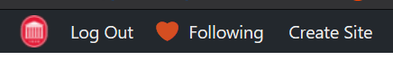
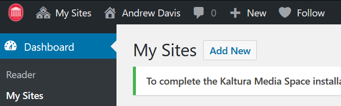

# Week 1: Foundations and Blogs

### To Do
- Study and understand course syllabus, communication methods, and platforms.
- Create Digital Media blog and Identify focus/topic
- Write introductory post for Digital Media blog
- Study and understand Information Design project

### To Read
- Federman, "What is the Meaning of Medium is the Message?"
- Lohman, "What is Technical Writing?"
- Wikibooks, "The Contexts of Technical Information"
- Wikibooks, "Basic Assumptions and Potential Complications"

### To Watch
- Folding Ideas: Minisode- The Medium is the Message
- Edutopia: Elyse Eidman-Aadahl on Writing in the Digital Age (Big Thinkers Series)

# [Course Syllabus, communication methods, and platforms](/about_this_course)

# Submit Digital Media Blog focus/topic 

Visit [edblogs.olemiss.edu](http://edblogs.olemiss.edu) and create a blog for WRIT 350. Sign in with your MyOleMiss Username and password. Once you are signed in, click **Create Site** or **My Sites** >> **Add New** on the administrative toolbar to generate your new blog.

or   

For **site name**, use your **WebID** (example: addavis). If you already have a site with that name (probably your WRIT 101/102 Commonplace Book), use your **WebID** + **writ350** (example: addaviswrit350). 

For site title, use your **full name** or something that easily identifies you (you can change it later). 

Make sure you select the **"WRIT 350 Digital Media Blog"** template before you click Create Site!

For the full assignment description, read the starter post on your new blog (or read it on the [blog template](http://edblogs.olemiss.edu/addavis/).)

Once you have created your blog and decided on a topic or focus, use this form to submit the blog URL and focus description to me.

# Blog Post #1: Introduction

The first post should introduce the scope and focus of the blog and who you are as an author. The description of the blog focus that you submitted to the Google Form above is a good place to start. Contextualize the topic with who you are and what your professional goals are. Why did you choose this focus? What in particular about it interests you? You should include a link to an external source that relates to your topic or focus. This can be a news article, a video, a Wikipedia article, or anything else that is relevant. Respond to the link in your post. What's the connection? Why did you choose that source for your very first post? Finally, set some goals for the future of the blog.

This post should probably be at least 250 words.

# [Information Design Project](/major_projects/information) 

# Readings and Media

- [Mark Federman: What is the Meaning of The Medium is the Message?](assets/MeaningTheMediumistheMessage.pdf)
- [Lohman: What is Technical Writing?](https://courses.lumenlearning.com/olemiss-technicalwriting/chapter/information-instructions-for-module-1_lecture-2/)
- [Wikibooks: The Many Contexts of Communicating Technical Information](https://courses.lumenlearning.com/olemiss-technicalwriting/chapter/the-many-contexts-of-communicating-technical-information/)
- [Wikibooks: Basic Assumptions and Complications](https://courses.lumenlearning.com/olemiss-technicalwriting/chapter/basic-assumptions-and-potential-complications/)

- [Folding Ideas: Minisode- The Medium is the Message](https://www.youtube.com/watch?v=OseOb_wBsi4)
- [Edutopia: Elyse Eidman-Aadahl on Writing in the Digital Age (Big Thinkers Series)](https://www.youtube.com/watch?v=sUlrzkpIgq8)
